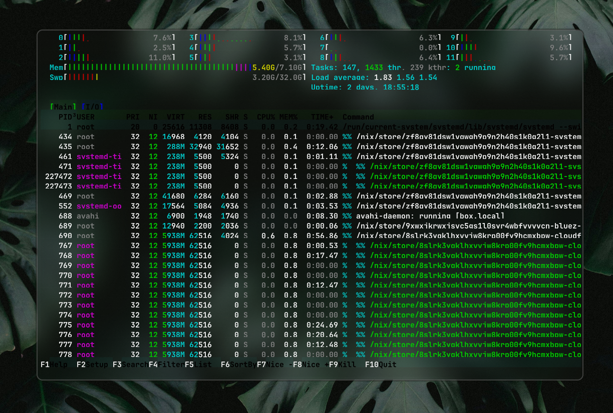
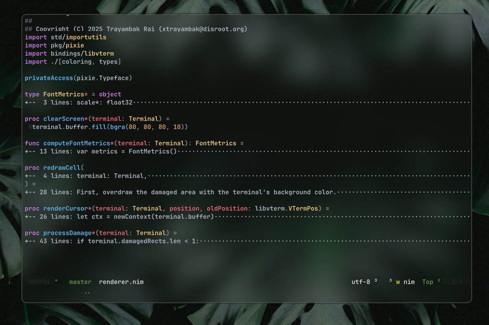

# nitty

Nitty is a software-rendered terminal emulator written in Nim.
It was written in ~4 days and has ~900 lines of code (if you exclude the windowing code).

It uses `libvterm` for handling VT output and acting upon it.




# Support
You can join [the Discord server](https://discord.gg/q49NSg8eaG) here for help with Nitty, or to follow its development.

# Features
- Runs most terminal apps fine (keyword: **most**)
  * In fact, this README was written entirely in Neovim running inside Nitty!
- Color rendering support
- Config file (`~/.config/nitty/config.toml`)
- Ctrl+Plus and Ctrl+Minus to increase/decrease font size
- **Okay** performance-wise, with room for optimizations.
- Tab completions in shells work

# Roadmap
- [X] Cursor rendering
- [ ] Input improvements (repeat key events, mostly)
- [ ] GPU acceleration via Boxy
- [ ] Packaging for distros
- [ ] Better damage tracking (currently, it forces the compositor to reblit the entire surface every frame)

# Config
Here's a basic config for Nitty:

```toml
[appearance]
background = "#5050500A"

[font]
name = "JetBrains Mono"
size = 24.0

[user]
shell = "zsh"
```

# Building
Nitty can be built using [Neo](https://github.com/xTrayambak/neo). After installing Neo, you can run the following command to compile Nitty:
```bash
$ neo install
```
