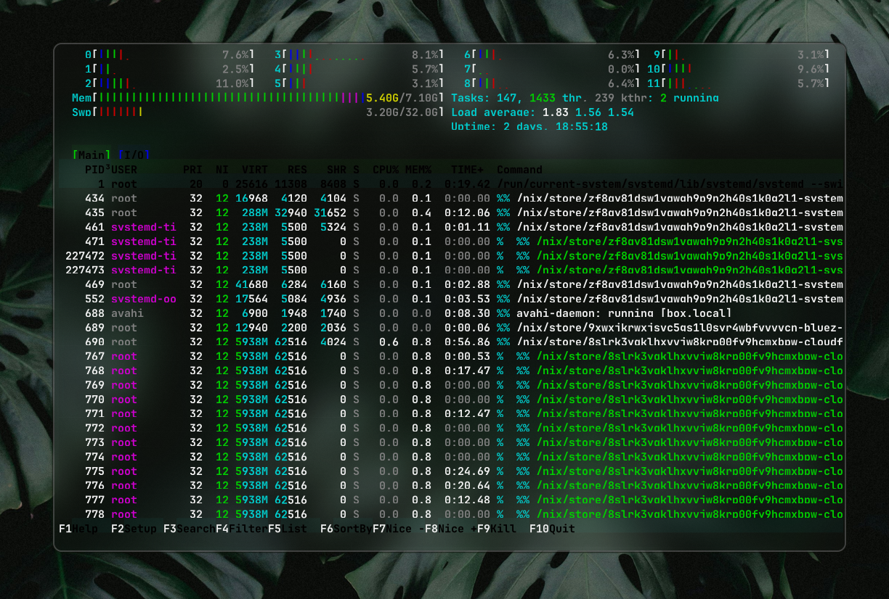
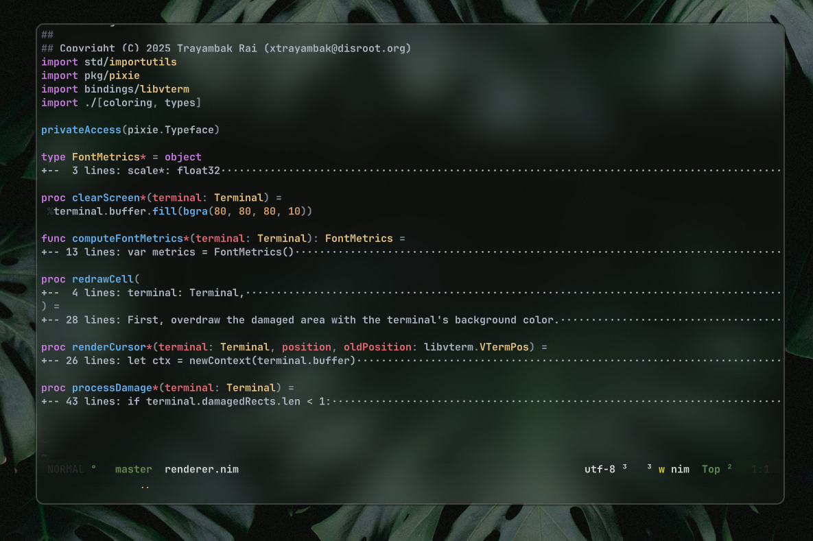

# nitty

Nitty is a fast terminal emulator written in Nim.
It was originally written in ~4 days and has ~1000 lines of code.

It uses its GPU-accelerated renderer by default. It used to have a CPU renderer, but that has been ripped out for simplicity's sake.

It uses `libvterm` for handling VT output and acting upon it.




# Support
You can join [the Discord server](https://discord.gg/q49NSg8eaG) here for help with Nitty, or to follow its development.

# Features
- Runs basically every terminal program fine
  * In fact, this README was written entirely in Neovim running inside Nitty!
- Color rendering support
- Config file (`~/.config/nitty/config.toml`)
- Ctrl+Plus and Ctrl+Minus to increase/decrease font size
- Fast and responsive, thanks to the OpenGL (ES) based GPU renderer™
- Tab completions in shells work

# Roadmap
- [X] Cursor rendering
- [X] Input improvements (repeat key events, mostly)
- [X] GPU acceleration via NanoVG
- [X] Focus tracking
- [ ] Scrollback using scroll wheel
- [X] Fractional scaling
- [ ] Mouse input
- [X] Bell
- [ ] Layer-shell mode (e.g, for running `cmatrix` as a desktop widget!)
- [ ] Packaging for distros

# Config
Here's a basic config for Nitty:

```toml
[appearance]
background = "#5050500A"

[font]
name = "JetBrains Mono"
size = 24.0

[user]
shell = "zsh"
bell = true
```

# Building
## Nix
Nitty provides a Nix flake. Simply add `github:xTrayambak/nitty` as an input, and add `inputs.nitty.packages.${pkgs.system}.default` to `home.packages`.

## Source Build
Nitty can be built using [Neo](https://github.com/xTrayambak/neo). After installing Neo, you can run the following command to compile Nitty:
```bash
$ neo install
```


